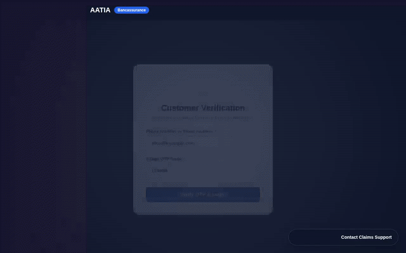

# AATIA — Asset & Travel Insurance Agent

[](https://github.com/adhissj/buildwithgemini-aatia-claims)
[](https://cloud.google.com/run)
[](https://cloud.google.com/vertex-ai)

**AATIA (Asset And Travel Insurance Agent)** is an intelligent AI claims concierge designed for banking clients. Built with Google's **Agent Development Kit (ADK)** and deployed on **Vertex AI Agent Runtime**, AATIA authenticates bank policyholders via OTP, verifies coverage limits, performs anti-fraud invoice signature checks, calculates actuarial payouts, and executes instant direct deposit claims disbursements.



---

## 🏛️ System Architecture

```
                                  ┌─────────────────────────────────────────┐
                                  │           AATIA Web Frontend            │
                                  │      (FastAPI Proxy on Cloud Run)       │
                                  └────────────────────┬────────────────────┘
                                                       │ A2A Protocol (IAM Auth)
                                                       ▼
                                  ┌─────────────────────────────────────────┐
                                  │         Vertex AI Agent Runtime         │
                                  │          (aatia-agent on ADK)           │
                                  └─┬──────────────────┬──────────────────┬─┘
                                    │                  │                  │
                                    ▼                  ▼                  ▼
                         ┌────────────────────┐ ┌──────────────┐ ┌──────────────────┐
                         │ Vertex AI Memory   │ │ Policy RAG   │ │ Anti-Fraud       │
                         │ Bank               │ │ Grounding    │ │ Duplicate Ledger │
                         └────────────────────┘ └──────────────┘ └──────────────────┘
```

---

## ⚡ Key Features & Capabilities

* **🔐 Identity Verification & OTP Authentication**: Secure 6-digit OTP verification via SMS/Email matching customer bank records (`verify_otp`).
* **🧠 Cross-Session Memory (Vertex AI Memory Bank)**: Integrated with `PreloadMemoryTool` and `add_session_to_memory` callbacks to retain policyholder identity, phone/email, bank account details (`Checking ***4321`), and claim history across sessions.
* **🛡️ Dual-Layer Anti-Fraud Ledger**: Prevents duplicate invoice double-dipping at both the proxy boundary and the agent engine (`PROCESSED_CLAIMS_LEDGER`). Re-submitting identical receipts triggers high-risk fraud alerts and directs users to dispute support.
* **🧮 Actuarial Payout Math**: Sandboxed financial calculation engine executing:
  $$\text{Approved Payout} = (\text{Expense Amount} - \text{Deductible}) \times \text{Coverage Rate}$$
* **📜 Digital Settlement Certificate**: Generates an official SHA-256 cryptographic audit certificate (`generate_settlement_certificate`) with FDIC compliance status and verification links.
* **💬 24/7 Floating Support Hotline**: Integrated web interface featuring a permanent bottom-right support widget (`1-800-AATIA-HELP`) and dispute escalation modal.

---

## ☁️ Google Cloud Services & Technologies Wired Up

| Service / Technology | Role in Project | Implementation File |
| :--- | :--- | :--- |
| **Vertex AI Agent Runtime** | Deployed backend Agent Engine hosting `aatia-agent` | [`aatia-agent/app/agent.py`](file:///config/Desktop/Session1/aatia-agent/app/agent.py) |
| **A2A Protocol (GA)** | Secure Agent-to-Agent streaming communication protocol | [`aatia-frontend/main.py`](file:///config/Desktop/Session1/aatia-frontend/main.py) |
| **Vertex AI Memory Bank** | Cross-session long-term memory store (`PreloadMemoryTool`) | [`aatia-agent/app/agent.py`](file:///config/Desktop/Session1/aatia-agent/app/agent.py) |
| **Google Cloud Run** | Containerized web frontend proxy (`aatia-frontend`) | [`aatia-frontend/Dockerfile`](file:///config/Desktop/Session1/aatia-frontend/Dockerfile) |
| **Google Agent Development Kit (ADK)** | Framework powering agent reasoning, callbacks, and tools | [`aatia-agent/pyproject.toml`](file:///config/Desktop/Session1/aatia-agent/pyproject.toml) |

---

## 🛠️ Integrated Agent Tools

1. `verify_otp`: Authenticates customer OTP credentials.
2. `validate_bank_account`: Verifies bank account KYC and direct deposit routing.
3. `list_policy_categories_and_products`: Returns policy coverage lines (Gadget, Auto & Mobility, Travel & Delay).
4. `get_policy_document_package`: Retrieves grounding policy guidelines and coverage limits.
5. `calculate_claim_payout`: Computes deductible deductions and approved payout amounts.
6. `check_fraud_risk`: Evaluates duplicate invoice signatures and merchant fraud risk.
7. `submit_claim_payout`: Disburses approved payouts directly to validated bank accounts.
8. `generate_settlement_certificate`: Generates cryptographic SHA-256 digital settlement certificates.

---

## 📋 Planned / Future Features (Not Yet Implemented)

The following features were outlined in the original design brief and are planned for future releases:
* ⚠️ **Vision AI Receipt Forensics** *(Planned)*: Automated OCR scanning of uploaded physical receipt images using Gemini Flash Vision.
* ⚠️ **Multi-Currency FX Converter** *(Planned)*: Real-time foreign exchange currency conversions for overseas travel claims.
* ⚠️ **Firestore Persistent DB** *(Planned)*: Replacing the in-memory ledger with Google Cloud Firestore for persistent multi-region ledger storage.

---

## 🚀 Local Development & Setup Instructions

### Prerequisites
* Python 3.11+
* Google Cloud SDK (`gcloud`)
* `uv` package manager (`pip install uv`)

### 1. Run the Agent Locally

```bash
cd aatia-agent

# Install dependencies
uv sync

# Set environment variables
export GOOGLE_CLOUD_PROJECT="your-gcp-project-id"
export GOOGLE_CLOUD_LOCATION="us-east1"

# Run ADK local web server
uv run adk web --port 8000
```

### 2. Run the Frontend Proxy Locally

```bash
cd aatia-frontend

# Install dependencies
pip install -r requirements.txt

# Run FastAPI proxy server
python main.py
```

---

## 📜 License

Distributed under the Apache 2.0 License. See `LICENSE` for more information.
